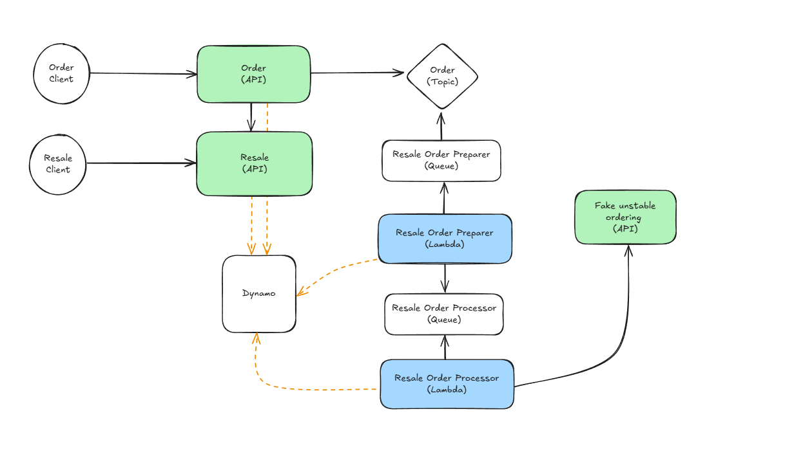

# Como executar o projeto



Execute o comando `docker-compose up --build -d` na raiz do projeto.

Após um tempo de build do docker, será iniciado o Local Stack (simulação serviços AWS), Terraform (IaC) e as APIs (estão em verde na imagem).
Você pode acompanhar os logs de cada API através dos containers docker. Caso queira verificar os registros no banco de dados Dynamo, recomendo baixar o [NoSQL Workbench for DynamoDB](https://docs.aws.amazon.com/amazondynamodb/latest/developerguide/workbench.settingup.html)

Para dar início, faça chamadas HTTP para Resale API e Order API.

# Resale API endpoints

### Save resale
```
POST /resales HTTP/1.1
Host: localhost:8081
Content-Type: application/json
Content-Length: 253

{
    "cnpj": "81.413.225/0001-71",
    "razaoSocial": "Super Empresa LTDA",
    "nomeFantasia": "Super",
    "email": "super@empresa.com",
    "telefone": "44912345678",
    "nomeContato": "Jose Super",
    "enderecoEntrega": "Rua das Pombas"
}
```

### Get resale
```
GET /resales/{id} HTTP/1.1
Host: localhost:8081
```

### Get all items

```
GET /items HTTP/1.1
Host: localhost:8081
```

# Order API endpoints

### Save order

```
POST /orders HTTP/1.1
Host: localhost:8082
Content-Type: application/json
Content-Length: 157

{
    "idResale": "2a4be8d6-0952-4ffd-bfd0-64782df78345",
    "items": [
        {"id": "a4d05832-b5a1-42d3-aa70-3267e09facb7", "quantity": 100}
    ]
}
```

### Get order

```
GET /orders/76c46ae4-9bfa-417d-aa26-2d6c55c96251 HTTP/1.1
Host: localhost:8082
```